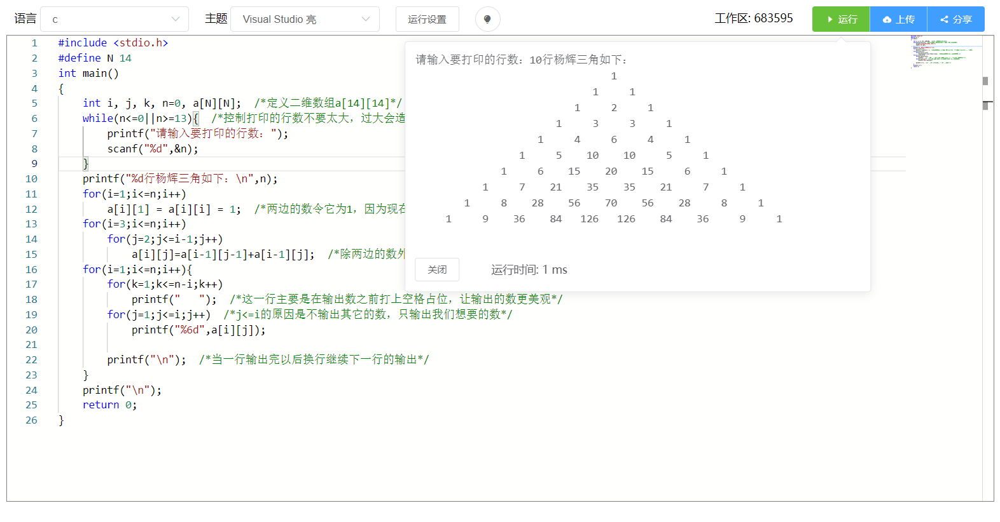

# online-editor


基于Monaco Editor开发的在线编辑器,目前能在线运行C、C++、Java、Python、Golang代码。

后端地址 <https://github.com/yanxiangrong/Online-Editor-Backend>  

### 已知 Bug
* 运行代码时，程序输出内容过多会导致后端崩溃
* 运行Java代码时，输出中文无法正常显示(会被替换为“?”)

## Project setup
```
npm install
```

### Compiles and hot-reloads for development
```
npm run serve
```

### Compiles and minifies for production
```
npm run build
```

### Lints and fixes files
```
npm run lint
```

### Customize configuration
See [Configuration Reference](https://cli.vuejs.org/config/).
